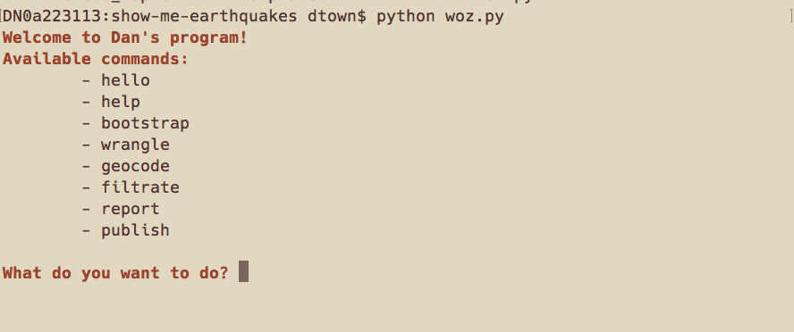
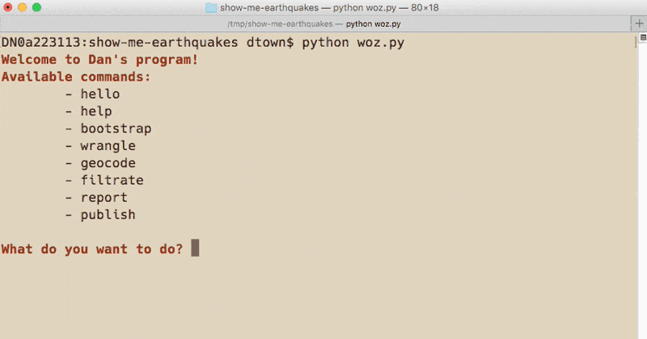
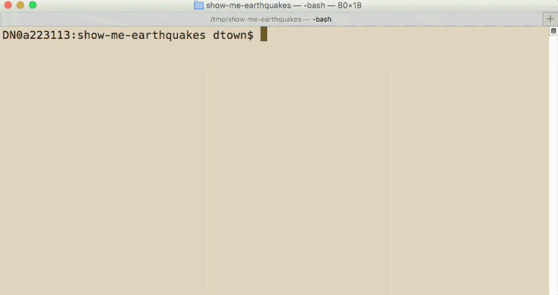

# Sample Show-Me Project for Earthquakes

# How to get started

This is a sample project that's meant to demonstrate how your project will work. The details will differ, but the flow is the same.

So try to copy this project (via the instructions below) and run it. You can put it anywhere and then delete it after you're done. Also, make sure you have a Mapzen Search API key.

## How to download it

The [project homepage is here](https://github.com/compciv/show-me-earthquakes).

### Downloading via point-and-click

Note: I don't recommend doing it this way. Use __git clone__ instead, as described in the next section.

Uh, since this program runs from the command-line anyway, you'll _eventually_ want to open up your system shell. But if you're having `git` problems, you can download a ZIP file of the project the old-fashioned way via this URL:

[https://github.com/compciv/show-me-earthquakes/archive/master.zip](https://github.com/compciv/show-me-earthquakes/archive/master.zip)

### Downloading via the command-line

First, `cd` into a directory that you want to dump it to, e.g. `cd ~/Desktop` or `cd /tmp`.

Then download it using the `git clone` command -- it will automatically create a subdirectory named `show-me-earthquakes`:

~~~sh
git clone https://github.com/compciv/show-me-earthquakes
~~~

Using __git clone__ is the way to do it. And it should work even if you don't have a Github account. 

Don't use these other methods unless __git clone__ doesn't work at all for you.

__Alternatively__, if you're having problems with `git`, you can download the URL via __curl__:

~~~sh
curl -Lo show-me-earthquakes.zip \
  https://github.com/compciv/show-me-earthquakes/archive/master.zip 
~~~

Then unzip that zip:

~~~sh
unzip show-me-earthquakes.zip
# this creates a subdirectory named show-me-earthquakes-master
# just rename it so the following instructions are consistent:
mv show-me-earthquakes-master/ show-me-earthquakes
~~~

Either way, via `git` or `curl` + `zip`, you should have a subdirectory named `show-me-earthquakes`. 

Change into the subdirectory:

~~~sh
cd show-me-earthquakes
~~~

Finally, you can run the program as you would any other Python script:

~~~sh
python woz.py
~~~

## Trying it out

Running `woz.py` should take you to a prompt like this:

And you should be able to try out any of those commands. For now, try the `"hello"` command:

### Getting a geocoding error

If you run the `geocode` command, you'll get an error:

~~~
Exception: ('Expecting credentials file at:', 'creds_mapzen.txt')
~~~

## Add your Mapzen key

It means what it says. So create a new file in the current directory named `creds_mapzen.txt`, then paste in your actual Mapzen API key, e.g.

      search-xxyyzz

Then try the `geocode` command.

### Seeing a webpage

Ultimately, your project will respond to a __publish__ command that will behave similarly to this demo project. But see if it works for you in the demo project. First you have to run `python woz.py` and run the following two commands:

- `bootstrap`
- `wrangle`

Then run it again, but run the `publish` command:

# That's all...

At this point, just make sure you can copy this project, run it on your own computer, and get a feel of how I expect things to be.

For now. I'll update you when this Github repo updates with more specific information. - Dan

